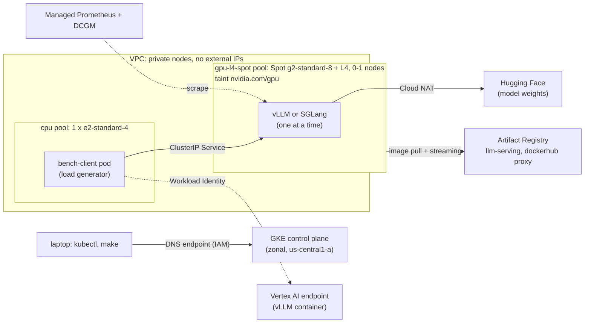

# LLM Serving on GKE vs. Vertex AI

> Serving **Qwen3-8B (AWQ)** on a single NVIDIA L4 three ways — vLLM on GKE, SGLang on GKE, and vLLM
> on a Vertex AI endpoint — and comparing latency, throughput, and cost under identical load. Plus
> LoRA fine-tuning and a debugging playbook of real, reproduced failures.

**Status:** 🚧 Load generator validated against a CPU mock server; Kubernetes manifests validated
on a local kind cluster; GKE infrastructure built with Terraform and verified on a real cluster
(GPU nodes pending a billing-account upgrade). No GPU benchmarks have been run yet. Every number in this README comes
from a saved run in [`results/`](results/).

---

## Overview

The question a client actually asks: *"Should we self-host our open model on GKE, or use a managed
Vertex AI endpoint?"* This repo answers it with measurements rather than opinions:

- Same model, same quantization, same GPU type (L4), same region (`us-central1`).
- Two self-hosted engines, **vLLM** and **SGLang**, against one managed option, **vLLM on Vertex
  AI**. (The original plan used TGI as the second engine. Its repository was archived and put in
  maintenance mode, with Hugging Face pointing users to vLLM and SGLang, so SGLang replaced it;
  status checked 2026-10-06.)
- Same load generator, same prompt-length distribution, same concurrency sweep.
- Metrics: **TTFT**, **inter-token latency (ITL)**, **output throughput vs concurrency**, and
  **$ per 1M output tokens**.

## Architecture



- **GKE Standard, zonal**, with a single on-demand CPU node and a **Spot L4 node pool that
  autoscales from 0**. GKE's GPU taint keeps everything but the inference server off it.
- **vLLM and SGLang** run as Deployments behind ClusterIP Services, with `/health` probes, a
  disruption budget and an optional queue-depth HPA ([`k8s/README.md`](k8s/README.md)).
- **Load generator in the cluster.** It runs on the CPU pool, the same client location for all
  three targets.
- **Identity.** Pods call Google APIs through Workload Identity Federation, with roles granted to
  their Kubernetes service accounts; no keys anywhere.
- **Infrastructure as code.** All of it is Terraform ([`infra/terraform/README.md`](infra/terraform/README.md)),
  with a $90 budget alert. `make gke-verify` checks a fresh cluster without a GPU: node pools,
  endpoint lockdown, Workload Identity allow and deny, registry pulls, NAT egress
  ([log of the first run](results/validation/gke/20261006T161339Z_gke_verify.txt)).

## Quickstart

> ⚠️ Commands marked 💲 create billable resources. Read [Cost](#cost) first.

Locally, no cloud needed:

```bash
make setup         # Python 3.11 venv + pre-commit hooks
make lint test     # ruff, yamllint, terraform fmt, kubeconform; unit + end-to-end tests
make bench-smoke   # validate the load generator against the CPU mock -> results/validation/
make mock          # terminal 1: mock OpenAI-compatible server on :8000
make bench         # terminal 2: concurrency sweep against it -> results/<timestamp>_mock/
make kind-up       # local kind cluster shaped like GKE (CPU node + tainted fake-GPU node)
make kind-e2e      # deploy the manifests with mock servers and check scheduling, probes, PDB, load
make kind-down     # delete the kind cluster
```

Against GCP (later phases):

```bash
cp .env.example .env                                            # fill in your values
cp infra/terraform/envs/dev/terraform.tfvars.example infra/terraform/envs/dev/terraform.tfvars
make tf-plan                                                    # plan only
make up                                                         # 💲 create infra
make deploy-vllm                                                # 💲 GPU node scales up
make bench BENCH_TARGET=vllm-gke BENCH_BASE_URL=http://<service>:8000 MODEL_ID=Qwen/Qwen3-8B-AWQ
make report RUNS="results/<vllm-run> results/<sglang-run> results/<vertex-run>"
make down                                                       # tear everything down
```

## Serving Setups

Both GKE stacks use the same manifests shape ([`k8s/`](k8s/), design notes in
[`k8s/README.md`](k8s/README.md)): one replica on a Spot L4 node, selected by node labels and the
GPU taint's toleration; `/health` startup and readiness probes, so no traffic reaches a server
before its weights are loaded; one-at-a-time rollouts; a `maxUnavailable: 1` PDB; and an optional
queue-depth HPA that is left out of benchmark runs. Both engines run with their defaults except a
shared 8,192-token context limit and the Qwen3 reasoning parser.

### vLLM on GKE
`vllm/vllm-openai:v0.31.0-cu129`, `vllm serve Qwen/Qwen3-8B-AWQ`. HPA signal:
`vllm:num_requests_waiting`.

### SGLang on GKE
`lmsysorg/sglang:v0.5.21-runtime`, `sglang.launch_server --model-path Qwen/Qwen3-8B-AWQ
--enable-metrics`. HPA signal: `sglang:num_queue_reqs`.

### vLLM on Vertex AI
_TODO._ Custom container → Artifact Registry → Model Registry → Endpoint → undeploy.

## Benchmark Method

The load generator in [`bench/`](bench/) is a small asyncio client that streams from the
OpenAI-compatible API that vLLM, SGLang and the Vertex container all expose
(`python -m bench --help`).

### Identical workload for every target

- **Deterministic prompts.** Request *i* is a pure function of `(seed, i)`, so every target receives
  byte-identical prompts in the same order. Each run's `meta.json` records a workload fingerprint,
  and `bench plot` / `bench cost` warn when the runs being compared don't match.
- **Prompt length** is drawn from a distribution in words (`--prompt-len uniform:200,800`). The
  servers report the exact token counts, which are saved per request.
- **No prefix-cache hits.** Each prompt starts with a unique random tag. vLLM and SGLang both
  cache shared prefixes by default, which would flatter TTFT.
- **Output length** comes from `max_tokens` (`--output-len`), with greedy decoding
  (`temperature=0`), so the same model generates (nearly) the same lengths on every server. Actual
  output tokens are recorded per request. Server-specific options such as vLLM's `ignore_eos` can be
  passed with `--extra-body`, but only if every target in the comparison supports them.
- **Where the client runs:** in the `bench-client` pod on the cluster's CPU node pool, in the
  same zone as the GPU node, for all three targets. Home-network latency stays out of TTFT, and
  the client never shares a node with the server it measures. Validated on kind; the GKE runs
  will record node and zone.

### Closed-loop load, measured at steady state

At concurrency *c*, *c* workers each keep exactly one request in flight. Each level runs in three
phases: **warm-up** (*c* requests), then **measured** (max(100, 4·*c*)), then **cool-down**. The
cool-down requests hold the load at *c* until the last measured request finishes, and are then
cancelled. So every measured request ran at the full concurrency, with no ramp-up or drain.
Measured prompts come from a fixed index block per level, so they're the same on every target
whatever the timing. Results are written after every level, so an interrupted sweep keeps what it
has already measured.

### Metrics (per level, in `summary.csv`)

| Metric | Definition |
|---|---|
| TTFT | Request sent → first streamed chunk carrying generated text. vLLM's empty `role` chunk doesn't count; Qwen3 reasoning tokens do. |
| TPOT | (last token − first token) ÷ (output tokens − 1), per request. Uses the server-reported token count. |
| ITL | Gaps between consecutive text chunks, pooled across requests (one chunk is normally one token). |
| E2E | Request sent → stream closed. |
| Output throughput | Tokens from *all* requests whose chunks arrived inside the window (first measured start → last measured finish), ÷ window length. |
| Requests/s | Output throughput ÷ mean output tokens. Counting completions directly is biased at small sample sizes, because the window's edges are themselves completions. |
| SLO attainment | Share of measured requests meeting `--slo-ttft-ms` / `--slo-tpot-ms`. Failures count as misses. |
| Little's-law ratio | Requests/s × mean E2E ÷ *c*. ≈ 1 when the client really kept *c* requests in flight. |
| Client loop lag | How late the client's event loop wakes up. If it's high, the client, not the server, is the bottleneck. |

Percentiles use linear interpolation (numpy's default). Latency metrics cover successful measured
requests; errors are counted separately and never dropped silently. `$ per 1M output tokens` =
hourly price ÷ (output tokens/s × 3600) × 10⁶. It is only computed from prices marked confirmed in
[`bench/prices.toml`](bench/prices.toml); otherwise the cost column stays empty.

### Validating the instrument first

Before any GPU time, `make bench-smoke` checks the client against a CPU-only mock server
([`bench/mock_server.py`](bench/mock_server.py)). The mock imitates continuous batching with
known step times, so TTFT, TPOT and throughput have analytic expected values. In the saved run
[`results/validation/20261006T124631Z_mock/validation.csv`](results/validation/20261006T124631Z_mock/validation.csv)
(six concurrency levels, 1–32), all 23 checks pass:

- TPOT is within 2.0% of expected and output throughput within 1.8%, at every level.
- TTFT is within 3.2% for *c* ≥ 2. At *c* = 1 it is +8.4% (+0.9 ms). *c* = 1 is the only level
  where client and mock sit idle between requests, and the extra time is the OS waking idle
  processes on a macOS laptop (in a quick side test it grew with the idle gap). At higher
  concurrency nothing idles.
- The Little's-law ratio is 0.99–1.00, so the client sustained the target concurrency.

## Results

> **Placeholder — no runs yet.** This section will only contain numbers produced by saved runs in
> [`results/`](results/), each with its raw CSV, config, and timestamp.

| Setup | TTFT p50 | TTFT p95 | ITL p50 | Max sustained tok/s | $ / 1M output tokens |
|---|---|---|---|---|---|
| vLLM on GKE | — | — | — | — | — |
| SGLang on GKE | — | — | — | — | — |
| vLLM on Vertex AI | — | — | — | — | — |

### What I'd recommend to a client and why
_TODO — written only after results exist._

## Fine-Tuning

_TODO._ LoRA on Qwen3-1.7B/4B with a public instruction dataset on a spot L4; registered in Model
Registry; served from a Vertex endpoint; before/after eval.

## Debugging Playbook

Reproduced failures, each written up as a postmortem (symptoms → isolation → root cause → fix) in
[`docs/postmortems/`](docs/postmortems/):

- [ ] CUDA out-of-memory
- [ ] Driver / CUDA version mismatch
- [ ] IAM permission denied from a pod
- [ ] Pod stuck `Pending` (quota or taints)
- [ ] Prompt-template regression

## Cost

Budget for this project: **~$90** of GCP credits, with a Terraform-managed budget alert at 50%,
75% and 100% of spend before credits. GPU nodes are **Spot** and the GPU pool scales to **zero**.
Vertex endpoints are **undeployed** right after each benchmark session.

List prices (us-central1) from the Cloud Billing Catalog API, saved in
[`results/prices/2026-10-06_catalog_us-central1.json`](results/prices/2026-10-06_catalog_us-central1.json):

| Resource | $/hour |
|---|---:|
| GKE GPU node: g2-standard-8 + 1 L4, Spot | 0.4865 |
| Vertex AI prediction node: g2-standard-8 + 1 L4, incl. management fee | 1.1099 |
| GKE CPU node: e2-standard-4, on-demand | 0.1340 |
| GKE zonal control plane | 0.10, covered by the free tier |

So the cluster idles at about **$0.15/h** (CPU node, its disk, the NAT IP), plus about $0.50/h
while a GPU node is up. The same prices are pre-filled in [`bench/prices.toml`](bench/prices.toml)
but marked unconfirmed: the $ per 1M tokens table only uses them once they are confirmed.

- _TODO:_ itemised actual spend per phase.

## Teardown

```bash
make down
```

`make down` runs `terraform destroy` on everything in [`infra/terraform`](infra/terraform/): the
cluster and both node pools, the VPC and NAT, Artifact Registry, IAM grants and the budget. Two
things stay, both free or nearly free: the enabled APIs, and the state bucket (a few KB). To
check that nothing billable is left:

```bash
gcloud container clusters list --project "$GCP_PROJECT_ID"
gcloud compute instances list --project "$GCP_PROJECT_ID"
gcloud artifacts repositories list --project "$GCP_PROJECT_ID" --location us-central1
```

Deleting the dedicated project removes everything, including the state bucket.

## Project Structure

```
.
├── infra/terraform/      # design notes in infra/terraform/README.md
│   ├── modules/          #   network (VPC, NAT), gke (cluster, cpu + spot L4 pools), registry
│   └── envs/dev/         #   APIs, modules, Workload Identity grants, budget; GCS remote state
├── k8s/                  # kustomize: bases, components, envs (design notes in k8s/README.md)
│   ├── common/           #   namespace, service account
│   ├── vllm/, sglang/    #   Deployment, Service, PDB (+ autoscaling/ HPA component)
│   ├── bench-client/     #   in-cluster load generator pod
│   ├── components/       #   kind-mock: CPU mock in place of the model server
│   └── envs/             #   kind/ (local validation) and gke/ (benchmark + autoscale shapes)
├── vertex/
│   ├── container/        # custom vLLM serving image
│   └── deploy/           # Model Registry upload, endpoint deploy/undeploy
├── bench/                # load generator: `python -m bench {run,mock,smoke,analyze,plot,cost}`
│   ├── client.py         #   streaming OpenAI-compatible client (TTFT/ITL from the SSE stream)
│   ├── runner.py         #   closed-loop concurrency sweep (warm-up / measured / cool-down)
│   ├── workload.py       #   deterministic prompts and length distributions
│   ├── metrics.py        #   per-level metrics (pure functions)
│   ├── mock_server.py    #   CPU-only continuous-batching mock for validation
│   ├── smoke.py          #   checks the client against the mock's analytic timings
│   ├── plots.py, cost.py #   charts and $ per 1M output tokens
│   ├── prices.toml       #   hourly prices with source, date and confirmed flag
│   └── Dockerfile        #   one small image: load generator + mock server
├── finetune/             # LoRA training + eval
├── results/              # saved runs — source of truth for every number
│   └── validation/       #   mock validation runs; kind/ holds the in-cluster test sweeps
├── docs/postmortems/     # debugging playbook
├── tests/                # unit tests (no cloud)
└── scripts/              # quota check, state bootstrap, image push, GKE + kind checks, manifests
```

## License

[MIT](LICENSE)
